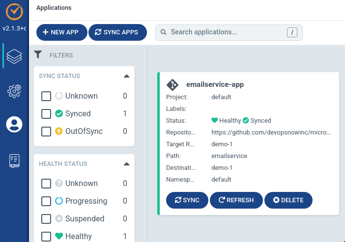

# microservices-argo-apps

Defines a set of Argo CD `Application` resources to deploy a cloud-native microservices demo application known as Online Boutique from GCP at https://github.com/GoogleCloudPlatform/microservices-demo

(This sample microservices application is chosen as it provides a rich mix of open logs, metrics, and traces which we can send into [DevOpsNow's ObserveNow backend](https://www.devopsnow.io) - a fully-managed observability stack comprising of open-source tools such as Jaeger, Grafana, Loki, Prometheus, and VictoriaMetrics)

## Purpose

To allow a single repo for Argo CD to easily deploy a sample application (for demonstration purposes).

## Assumptions

* You already have access to your own Kubernetes cluster (or a managed one like EKS, GKE, AKS, etc)
* You have an Argo CD setup for which declarative, GitOps-based continuous deployment lifecycle is managed (if you don't have access to this, you may request one [from DevOpsNow via its DeployNow](https://www.devopsnow.io) managed Argo CD service). 

## Usage

Via Argo CD UI or CLI (shown here), you can:

1.  Log into your Argo instance:

    ```
    $ argocd login ${ARGO_HOST} --username ${ARGO_USER} --password ${ARGO_PASS} --grpc-web
    ```

    **or** (if your Org only allow SSO access):

    ```
    $ argocd login ${ARGO_HOST} --sso --grpc-web
    ```

2.  Fork this Git repo (or any repo you have) and add it:

    ```
    $ argocd repo add https://github.com/<yourFork>/microservices-argo-apps
    ```

3.  Add your target Kubernetes cluster (ensure you're on it):

    ```
    $ argocd cluster add <nameOfClusterConfig> --name <nameOfCluster>
    $ argocd cluster list
    ```

4.  Create the Argo Applications (apps) for whichever services you wish Argo CD deploy... e.g.,:

    ```
    $ for myapp in adservice cartservice checkoutservice currencyservice emailservice frontend loadgenerator paymentservice productcatalogservice recommendationservice redis-cart shippingservice; do \
        argocd app create ${myapp}-app --repo https://repo/from/step/2 --path ${myapp} --revision demo-1 --dest-server https://<fromStep3> --dest-namespace <targetNamespace>; \
      done
    ```

    e.g., running above for just `myapp=emailservice` and then checking your Argo instance should show the app created and healthy:

    

    **or**, alternatively (instead of each app created separate) _if your destination cluster has Argo CD CRDs installed on it_, you can use the [App of Apps Pattern](https://argo-cd.readthedocs.io/en/stable/operator-manual/declarative-setup/#app-of-apps) to create a single Argo Application which would, in turn, create all the child apps:

    ```
    ## Ensure our child app defs are pointing to the correct cluster and git repos (from Step 2 and 3 above):
    $ cd apps/
    $ sed -i 's/kubernetes.changeme.svc/10.64.52.7/g' *.yaml
    $ # ^ similar for the git repo added in step (2)

    ## Create the app-of-apps
    $ argocd app create app-of-apps --repo https://repo/from/step/2 --path apps --revision HEAD --dest-server https://<fromStep3> --directory-recurse
    ```
